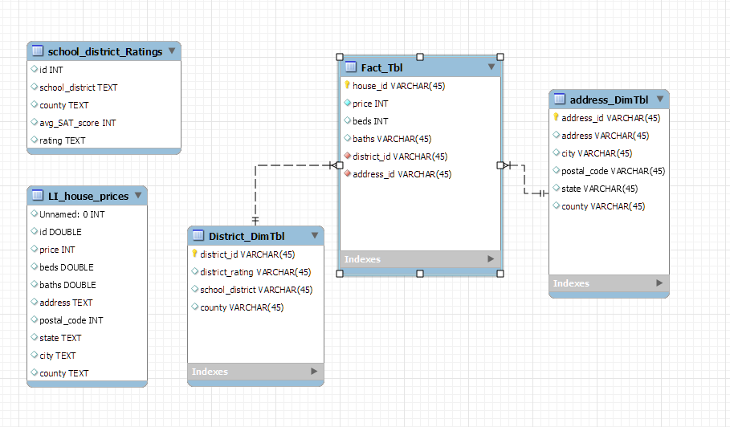

I completed this project in December 2022 as part of the Data Warehousing For Analytics class.

### Project objective:
Determine if there is any correlation between K12 school ratings and house prices in Suffolk and Nassau counties on Long Island, NY.

### Data sourcing: 
Build two Python web scrapers: one for scraping school ranking data and another one for scraping real estate inventory.

- School ranking data was scraped from:
https://www.realestatehudsonvalleyny.com/resources/best-school-districts-long-island/

- Housing inventory information was scraped from realtor.com

### Data modeling:
Apply star schema to the data.  Use MySQL Workbench ER modeling feauture to create the UML diagram.

### Data processing:
Process and merge sourced data and produce two .CSV files ready for data visualizaiton.

### Data visualization:
Use Tableau to generate visualizations to see if any trends can be spotted.

